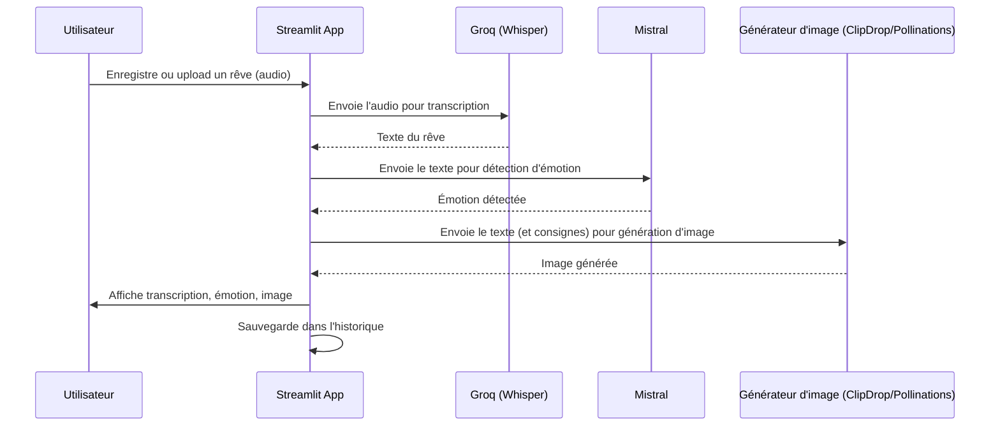

# 🌙 Synthétiseur de rêves

**Synthétiseur de rêves** est une application web interactive qui permet à l'utilisateur de raconter un rêve à voix haute (ou d'uploader un fichier audio), d'en obtenir la transcription, une image générée à partir du rêve, une analyse émotionnelle, et de conserver un historique de ses rêves.

---

## 🚀 Fonctionnalités principales

- **Enregistrement audio** depuis le navigateur ou upload de fichier `.wav`/`.mp3`
- **Transcription automatique** du rêve (modèle Whisper via Groq)
- **Génération d'image** à partir du rêve (ClipDrop ou Pollinations, prompt enrichi)
- **Détection d'émotion** (heureux, stressant, neutre, etc. via Mistral)
- **Historique des rêves** (consultable dans la sidebar, persistant)

---

## 🖥️ Installation

1. **Cloner le dépôt**
   ```bash
   git clone <url-du-repo>
   cd projet_fin_du_module
   ```

2. **Créer un environnement virtuel (optionnel mais recommandé)**
   ```bash
   python -m venv env
   source env/bin/activate  # ou .\env\Scripts\activate sous Windows
   ```

3. **Installer les dépendances**
   ```bash
   pip install -r requirements.txt
   ```

4. **Installer ffmpeg** (pour l'enregistrement audio)
   - **macOS** : `brew install ffmpeg`
   - **Ubuntu/Debian** : `sudo apt install ffmpeg`
   - **Windows** : [Télécharger ici](https://ffmpeg.org/download.html) et ajouter le dossier `bin` à votre PATH

5. **Configurer les clés API**
   - Créez un fichier `.env` à la racine du projet :
     ```env
     GROQ_API_KEY=VOTRE_CLE_GROQ
     MISTRAL_API_KEY=VOTRE_CLE_MISTRAL
     ```
   - (ClipDrop et Pollinations n'ont pas besoin de clé pour la démo)

---

## 🎬 Lancer l'application

```bash
streamlit run app.py
```

L'interface s'ouvre dans votre navigateur. Vous pouvez :
- Enregistrer un rêve ou uploader un fichier audio
- Voir la transcription, l'image générée, l'émotion détectée
- Consulter l'historique dans la sidebar

---

## 📁 Structure du projet

```
projet_fin_du_module/
│
├── app.py                # Application principale Streamlit
├── main.py               # (point d'entrée legacy, non utilisé)
├── requirements.txt      # Dépendances Python
├── README.md             # Ce fichier
├── .env                  # (à créer, pour les clés API)
├── historique.json       # Historique des rêves (généré automatiquement)
└── utils/
    ├── audio.py          # Transcription audio
    ├── image.py          # Génération d'image
    ├── emotion.py        # Détection d'émotion
    └── history.py        # Gestion de l'historique
```

---

## 🛠️ Dépendances principales
- `streamlit` ≥ 1.35
- `streamlit-audiorecorder` (enregistrement micro)
- `requests` (API HTTP)
- `groq` (API Whisper)
- `mistralai` (API Mistral)
- `python-dotenv` (gestion des clés)
- `ffmpeg` (dépendance système pour l'audio)

---

## ✨ Personnalisation
- Vous pouvez enrichir le prompt pour la génération d'image dans `utils/image.py`.
- L'historique est stocké en base64 pour les images, mais peut être adapté (fichiers, cloud, etc.).
- Possibilité d'ajouter d'autres analyses ou visualisations dans l'historique.

---

## 📣 Auteurs & crédits
- Projet pédagogique HETIC — 2025
- Réalisé par : Aboubacrine Seck
- IA utilisées : Groq (Whisper), Mistral, ClipDrop, Pollinations

---

## 🧑‍💻 Bonnes pratiques
- Code PEP8, type hinting, docstrings Google style
- Séparation claire des modules (audio, image, émotion, historique)
- Utilisation sécurisée des clés API (fichier `.env` non versionné)

---

## 📝 Licence
Ce projet est fourni à des fins pédagogiques. Pour tout usage commercial, merci de vérifier les licences des APIs utilisées.

---

## 📊 Étude d'art / Benchmark des APIs

| API                | Coût (USD)                | Temps de réponse | Quota / Limite | RGPD / Données |
|--------------------|---------------------------|------------------|---------------|---------------|
| **Groq (Whisper)** | ~$0.006 / min audio*      | Rapide (<10s)    | Selon offre   | Données traitées sur serveurs US, pas d'hébergement en Europe, pas RGPD natif |
| **Mistral**        | ~0.25€ / 1M tokens*       | Rapide (<5s)     | Selon offre   | Serveurs EU, RGPD friendly |
| **ClipDrop**       | ~1 crédit / image*        | Moyen (5-10s)    | 100 images/mois gratuites, puis payant | Données traitées hors UE, pas RGPD natif |
| **Pollinations**   | Gratuit (open API)        | Variable (5-20s) | Pas de garantie | Données publiques, pas RGPD |

*Tarifs indicatifs, à vérifier sur les sites officiels. Les quotas et la conformité RGPD peuvent évoluer selon les offres et les usages.

---

## 🔄 Séquence clé : traitement complet d'un rêve

